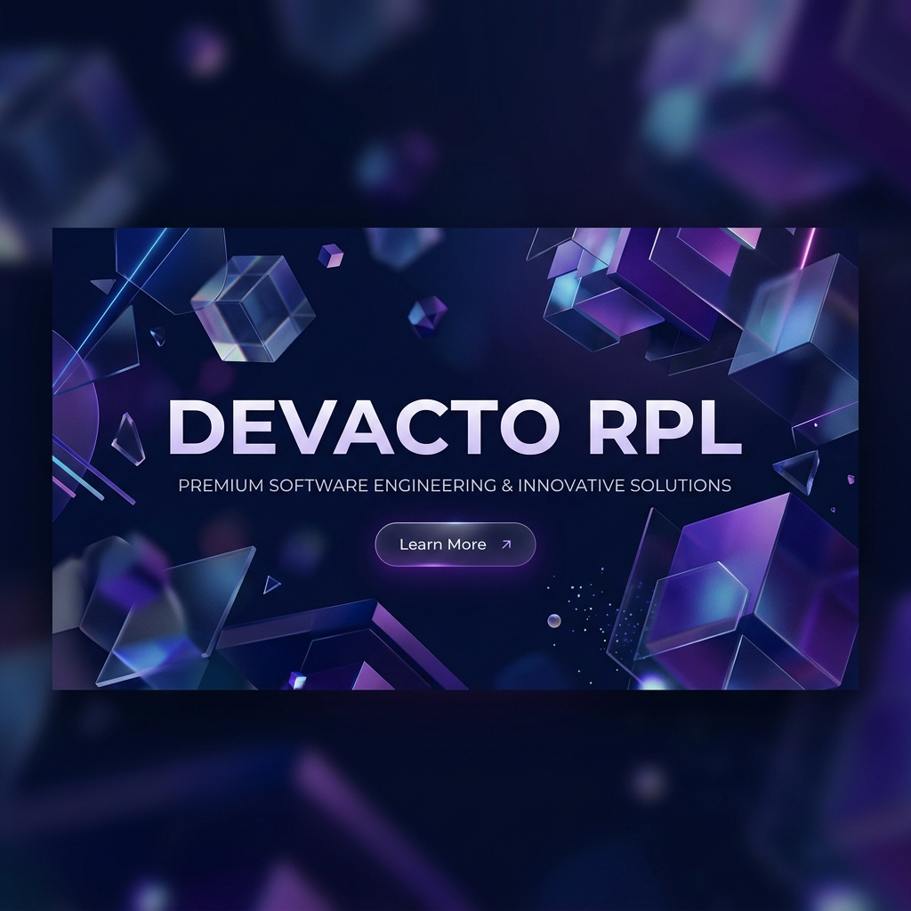

<div align="center">
  
  
  <br />

  <h1>💎 DEVACTO RPL: Digital Excellence Redefined</h1>
  
  <p align="center">
    <strong>Elevating the standard of Rekayasa Perangkat Lunak with cutting-edge design and seamless interactivity.</strong>
  </p>

  <p align="center">
    <a href="#-key-features">Features</a> •
    <a href="#-technical-architecture">Architecture</a> •
    <a href="#-getting-started">Deployment</a> •
    <a href="#-design-philosophy">Philosophy</a>
  </p>

  <div align="center">
    
    
    
    
  </div>
</div>

---

## 🏛️ Executive Summary

**DEVACTO RPL** is a premier digital showcase engineered for the modern software engineering community. It transcends traditional landing pages by blending **high-performance architecture** with a **bespoke visual identity**. Built on the foundations of React 19 and Vite, it delivers an immersive user experience through industry-standard animations and a sophisticated "Modern Brutalist" aesthetic.

---

## ✨ Key Features & Experience

### 🚀 High-Fidelity Interactivity
Utilizing the **GreenSock Animation Platform (GSAP)**, every interaction is meticulously crafted. From scroll-triggered sequence animations to fluid component transitions, the interface feels alive and responsive.

### 📦 Bespoke 3D Components
- **The Interactive Monitor**: A high-end 3D visualization that serves as a focal point for showcasing technical prowess.
- **The Digital Manuscript**: A physics-based interactive book component that narrates the journey and pricing models with a tactile feel.

### 🎨 Modern Brutalist Aesthetic
A bold, confident design language featuring:
- High-contrast color palettes.
- Offset elevation shadows for depth.
- Premium typography using variable sans-serif fonts.

### 📱 Universal Responsiveness
Engineered to deliver a consistent, luxury experience across all viewports—from ultra-wide workstation monitors to high-end mobile devices.

---

## 🛠️ Technical Architecture

This project is built using a modern, scalable stack designed for speed and maintainability.

| Layer | Technology | Rationale |
| :--- | :--- | :--- |
| **Framework** | React 19 (Latest) | Utilizing the latest concurrent rendering features for peak performance. |
| **Build Tool** | Vite 8 | Ensuring near-instantaneous Hot Module Replacement (HMR) and optimized builds. |
| **Styling** | Tailwind CSS 4.0 | A utility-first CSS approach optimized for high-speed development and minimal bundle size. |
| **Animation** | GSAP | The industry standard for complex, high-performance web animations. |
| **Icons** | Custom SVG / Heroicons | Vector-based iconography for sharpness on all display types. |

---

## 📂 System Overview

```text
landpage-devacto-rpl/
├── 📁 public/           # Static assets (Luxury Banners, Icons, Videos)
├── 📁 src/
│   ├── 📁 assets/       # Internal media & design tokens
│   ├── 📁 components/   # Reusable UI Atoms & Molecules
│   │   ├── Navbar.jsx   # Context-aware navigation
│   │   ├── Footer.jsx   # Comprehensive site map & credits
│   │   └── ...          # Section-specific components
│   ├── 📁 pages/        # Core views (Home.jsx)
│   ├── App.jsx          # Main application orchestration
│   └── App.css          # Global design system & utility classes
└── vite.config.js       # Advanced build configurations
```

---

## 🚀 Getting Started

### Prerequisites
- **Node.js** v20.x or higher
- **npm** v10.x or higher

### Installation & Development
1.  **Clone the Repository**
    ```bash
    git clone https://github.com/yafaiky/landpage-devacto-rpl.git
    cd landpage-devacto-rpl
    ```

2.  **Environment Setup**
    ```bash
    npm install
    ```

3.  **Launch the Development Server**
    ```bash
    npm run dev
    ```

4.  **Production Optimization**
    ```bash
    npm run build
    ```

---

## 🎨 Design Philosophy

At its core, **DEVACTO RPL** is built on the principle of **"Technical Sophistication Meets Visual Boldness"**. We avoid the generic to embrace the unique. Our "Modern Brutalist" approach reflects the raw power of software engineering, while our animations add the polish expected from a world-class digital product.

---

<div align="center">
  <p>Crafted with precision by the <strong>Devacto Team</strong></p>
  <p>© 2025 DEVACTO RPL. All Rights Reserved.</p>
</div>
